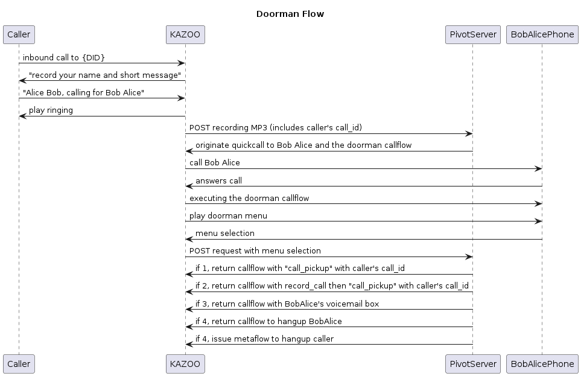

#+OPTIONS: toc:nil

* Doorman Demo

** Definitions

In the following API commands and PHP scripts, there are placeholder values to be filled in as appropriate. We will define those here:

| Placeholder         | Description                                                           |
| =$AUTH_TOKEN=       | The KAZOO authentication JWT for API calls                            |
| =$API_URL=          | The KAZOO API URL - =https://sandbox.2600hz.com:8443/v2= for instance |
| =$AUTH_USER_NAME=   | The KAZOO username for logging in via API                             |
| =$AUTH_PASSWORD=    | The KAZOO password for logging in via API                             |
| =$ACCOUNT_ID=       | The KAZOO Account ID                                                  |
| =$DOORMAN_SERVER=   | The web server where the doorman application scripts reside           |
| =$INCOMING_DID=     | The DID dialed by the caller to start the doorman process             |
| =$DOORMAN_EXT=      | The extension used to initiate the doorman callflow                   |
| =$DEVICE_ID=        | The callee's device to ring for doorman                               |
| =$VOICEMAIL_BOX_ID= | The callee's voicemail box to use for option 3                        |

** Ladder diagram

The basic flow, in visual form:

#+begin_src plantuml :file doorman.png
title Doorman Flow

Caller->KAZOO: inbound call to {DID}
KAZOO->Caller: "record your name and short message"
Caller->KAZOO: "Alice Bob, calling for Bob Alice"
KAZOO->Caller: play ringing
KAZOO->PivotServer: POST recording MP3 (includes caller's call_id)
PivotServer->KAZOO: originate quickcall to Bob Alice and the doorman callflow
KAZOO->BobAlicePhone: call Bob Alice
BobAlicePhone->KAZOO: answers call
KAZOO->BobAlicePhone: executing the doorman callflow
KAZOO->BobAlicePhone: play doorman menu
BobAlicePhone->KAZOO: menu selection
KAZOO->PivotServer: POST request with menu selection
PivotServer->KAZOO: if 1, return callflow with "call_pickup" with caller's call_id
PivotServer->KAZOO: if 2, return callflow with record_call then "call_pickup" with caller's call_id
PivotServer->KAZOO: if 3, return callflow with BobAlice's voicemail box
PivotServer->KAZOO: if 4, return callflow to hangup BobAlice
PivotServer->KAZOO: if 4, issue metaflow to hangup caller
#+end_src

#+RESULTS:

** Setup an account

There are two primary callflows to create, the handler for incoming calls to users, and the doorman callflow for the recipient.

*** Incoming calls

The basic flow defined below is:

1. Caller hears welcome message and instruction to record name/purpose
2. After the beep, call recording for 8s
3. Once recording finishes, 2 things will happen
  a. The caller will hear ringing
  b. The recording will be sent to =$DOORMAN_SERVER= via HTTP POST

#+begin_src js
{
  "flow": {
    "module": "tts",
    "data": {
      "text": "Hi. You have reached the doorman demo. Record your name and reason for your call"
    },
    "children": {
      "_": {
        "module": "tones",
        "data": {
          "tones": [
            {
              "duration_off": 100,
              "duration_on": 500,
              "frequencies": [
                440
              ]
            }
          ]
        },
        "children": {
          "_": {
            "module": "record_caller",
            "data": {
              "time_limit": 8,
              "url": "$DOORMAN_SERVER/",
              "method": "post"
            },
            "children": {
              "_": {
                "module": "tones",
                "data": {
                  "tones": [
                    {
                      "frequencies": [
                        440,
                        480
                      ],
                      "duration_on": 2000,
                      "duration_off": 4000,
                      "repeat": 20
                    }
                  ]
                }
              }
            }
          }
        }
      }
    }
  },
  "name": "doorman caller setup",
  "numbers": [
    "$INCOMING_DID"
  ]
}
#+end_src

#+BEGIN_SRC sh
curl -v -X PUT \
  -H "x-auth-token: $AUTH_TOKEN" \
  -H "content-type: application/json" \
  $API_URL/accounts/$ACCOUNT_ID/callflows \
  -d '{"data":{"flow":{"module":"tts","data":{"text": "Hi. You have reached the doorman demo. Record your name and reason for your call"},"children":{"_":{"module": "tones", "data":{"tones": [{"duration_off": 100,"duration_on": 500,"frequencies": [440]}]},"children":{"_":{"module": "record_caller","data":{"time_limit": 8,"url": "$DOORMAN_SERVER/", "method":"post"}, "children":{"_":{"module": "tones","data":{"tones":[{"frequencies":[440,480],"duration_on": 2000,"duration_off":4000,"repeat":20}]}}}}}}}},"name": "doorman caller setup","numbers":["$INCOMING_DID"]}}'
#+END_SRC

*** Doorman callflow

The doorman callflow is a Pivot flow to fetch the prompts+recording for the recipient:

#+begin_src js
{
  "flow": {
    "data": {
      "voice_url": "$DOORMAN_SERVER/callee.php"
    },
    "module": "pivot"
  },
  "name": "doorman callee",
  "numbers": [
    "$DOORMAN_EXT"
  ]
}
#+end_src

#+BEGIN_SRC sh
curl -v -X PUT \
  -H "x-auth-token: $AUTH_TOKEN" \
  -H "content-type: application/json" \
  $API_URL/accounts/$ACCOUNT_ID/callflows \
  -d '{"data":{"numbers":["$DOORMAN_EXT"],"name":"doorman callee","flow":{"module":"pivot","data":{"voice_url":"$DOORMAN_SERVER/callee.php"}}}}'
#+END_SRC

** Call handling

Here we will walk through how a call to =$INCOMING_DID= is processed via the doorman scripts

1. Inbound call to KAZOO to =$INCOMING_DID= initiates the "doorman caller setup" callflow
2. After the caller records their name/message and starts hearing ringing, KAZOO will POST the recording to the =$DOORMAN_SERVER/intro.php=:
#+BEGIN_SRC php
<?php
// parse the querystring into an array and put it in $qs
parse_str($_SERVER['QUERY_STRING'], $qs);

// get the call id of the caller and the recording id from the querystring
$recording_id = $qs['recording_id'];
$call_id = $qs['call_id'];

$filename = "files/" . $recording_id . ".mp3";

// read the POST request body (the recording) into
$recording_data = file_get_contents("php://input");

// write the recording data into a local directory (here files/{RECORDING_ID}.mp3 relative to where the script is)
file_put_contents(dirname(__FILE__) . "/" . $filename, $recording_data);

// initiate a shell command to start the doorman/callee side of the call
$cmd = sprintf("php quickcall.php %s %s > %s &", escapeshellarg($call_id), escapeshellarg($recording_id), escapeshellarg("/tmp/".$recording_id.".txt"));
exec($cmd);

// the response to the POST is ignored but return something nice anyway
header('content-type: application/json');
?>
{'status':'success'}
#+END_SRC

3. The recording POST will execute the =quickcall.php {CALL_ID} {RECORDING_ID} > /tmp/{RECORDING_ID}.txt= script in the background to initiate the call to the callee, put any output into the tmp file, and initiate a [[https://docs.2600hz.com/dev/applications/crossbar/doc/quickcall/][quickcall]] to the callee and the doorman callflow
#+BEGIN_SRC php
<?php
$call_id = $argv[1];
$recording_id = $argv[2];

$account_id = "$ACCOUNT_ID";
$api_url = "$API_URL";

// here we're going to use the Basic auth mechanism instead of getting an auth token first
$credentials = md5("$AUTH_USER_NAME:$AUTH_PASSWORD");

// we can ring a user (all 'owned' devices) or a device ID
$device_id = "$DEVICE_ID";

// setup the quickcall between the device and the doorman extension
$quickcall_url = $api_url . "/accounts/$account_id/devices/$device_id/quickcall/$DOORMAN_EXT";

// add custom application variables (CAVs) for the recording_id (for playback) and call_id (for bridging)
// CAVs will be present on the doorman Pivot request
// target_call_id tells KAZOO to start the new call on the same server as the caller's leg
// auto_answer=false makes sure a SIP header to instruct phones to automatically answer the call will not be set
// cid-name will set the Caller ID Name the device will see
$req_json = array("data" =>
                         array("custom_application_vars" =>
                                                         array("recording_id" => $recording_id,
                                                                   "call_id" => "$call_id"
                                                                              ),
                                   "target_call_id" => $call_id,
                                   "auto_answer" => false,
                                   "cid-name" => "Doorman"
                                                         )
                         );
$req_body = json_encode($req_json);

$ch = curl_init();
$curl_opts = array(CURLOPT_URL => $quickcall_url
                   ,CURLOPT_RETURNTRANSFER => true
                   ,CURLOPT_USERPWD => "$account_id:$credentials"
                   ,CURLOPT_POST => true
                   ,CURLOPT_POSTFIELDS => $req_body
                   ,CURLOPT_HTTPHEADER => array("content-type" => "application/json")
);
curl_setopt_array($ch, $curl_opts);

$response = curl_exec($ch);
echo $response;

curl_close($ch);
?>
#+END_SRC

As a side note, I did add an =.htaccess= to rewrite the URL KAZOO uses for the recording:

#+begin_src apache
RewriteEngine On
RewriteRule .*call_recording.* /intro.php [L,QSA]
#+end_src

4. Quickcall will start a leg from KAZOO->device. Once the device answers, KAZOO will start the =$DOORMAN_EXT= callflow, creating a Pivot request to =$DOORMAN_SERVER/callee.php=
#+BEGIN_SRC php
<?php
// Pivot endpoint to control the callee side of the doorman app

parse_str($_SERVER['QUERY_STRING'], $qs);

// use the CAVs to find the correct recording
$recording_id = $qs["Custom-Application-Vars"]["recording_id"];
$filename = "files/" . $recording_id . ".mp3";

header("content-type: application/json");

// return the prompts + URL to the recording for the doorman menu options
?>
{
    "module":"audio_macro",
    "data":{
        "macros":[
            {"macro":"tts",
             "text":"Call from"
            },
            {"macro":"play",
             "id":"$DOORMAN_SERVER/<?= $filename ?>"
            },
            {"macro":"tts",
             "text":"Press 1 to answer the caller."
            },
            {"macro":"tts",
             "text":"Press 2 to answer the caller and start recording."
            },
            {"macro":"tts",
             "text":"Press 3 to send caller to voicemail."
            },
            {"macro":"tts",
             "text":"Press any other key, or hangup, to reject the caller."
            }
        ]
    },
    "children":{
        "_":{
            "module":"collect_dtmf",
            "data":{
                "max_digits":1,
                "timeout":3000,
                "collection_name":"callee_choice"
            },
            "children":{
                "_":{
                    "module":"pivot",
                    "data":{
                        "voice_url":"$DOORMAN_SERVER/callee_menu.php",
                        "req_format":"kazoo"
                    }
                }
            }
        }
    }
}
#+END_SRC

5. After the prompts/recording play and the callee selects a menu option, a Pivot request to callee_menu.php will handle the selection. If voicemail or hangup are chosen, an API request to run the [[https://docs.2600hz.com/dev/applications/crossbar/doc/channels/#put-a-feature-metaflow-on-a-channel][metaflow]] against the caller's leg is sent before returning a hangup to the callee.
#+BEGIN_SRC php
<?php
// given the DTMF selection of the callee, return the Pivot response for each option
parse_str($_SERVER['QUERY_STRING'], $qs);

// CAVs persist on each request, so fetch the caller's Call-ID for bridging
$target_call_id = $qs["Custom-Application-Vars"]["call_id"];
$account_id = $qs["Account-ID"];

// fetch the pressed DTMF from the collection 'callee_choice'
$dtmf = $_REQUEST['Digits']['callee_choice'];

header("content-type: application/json");

switch ($dtmf) {
case "1": connect_caller($target_call_id); break;
case "2": connect_record($target_call_id); break;
case "3": voicemail($account_id, $target_call_id); break;
case "4":
default: hangup($account_id, $target_call_id);
}

// instruct the b-leg to pickup the a-leg (target)
function connect_caller($target_call_id) {
    ?>
{
  "module": "call_pickup",
  "data": {
    "target_call_id": "<?= $target_call_id ?>"
  }
}
<?php
}

// start call recording, then bridge the caller leg
function connect_record($target_call_id) {
?>
{
  "module": "record_call",
  "data": {
    "action": "start",
    "url": "$DOORMAN_SERVER/call_recordings"
  },
  "children": {
    "_": {
      "module": "call_pickup",
      "data": {
        "target_call_id": "<?= $target_call_id ?>"
      }
    }
  }
}
<?php
}

// send the caller to a voicemail box
function voicemail($account_id, $target_call_id) {
    // send caller to voicemail
    $vm_action = array("module" => "voicemail",
                       "data" => array("id" =>  "$VMBOX_ID"
                       );
    send_metaflow($account_id, $target_call_id, array("data" => $vm_action);
    // hangup callee
?>
{
  "module": "hangup",
}
<?php
}

// hangup the callee and let the caller ring out
function hangup($account_id, $target_call_id) {
    // hangup caller
    send_metaflow($account_id, $target_call_id, array("module" => "hangup"));

    // hangup callee
?>
{
  "module":"hangup"
}
<?php
}

function send_metaflow($account_id, $call_id, $data) {
    $channels_url = "{API_URL}/accounts/$account_id/channels/$call_id/";
    $req_json = array("data" => $data,
                      "action":"metaflow"
                      );
    $req_body = json_encode($req_json);
    $credentials = md5("$AUTH_USER_NAME:$AUTH_PASSWORD");

    $ch = curl_init();

    $curl_opts = array(CURLOPT_URL => $channels_url
                       ,CURLOPT_RETURNTRANSFER => true
                       ,CURLOPT_USERPWD => "$account_id:$credentials"
                       ,CURLOPT_CUSTOMREQUEST => "PUT"
                       ,CURLOPT_POSTFIELDS => $req_body
                       ,CURLOPT_HTTPHEADER => array("content-type" => "application/json")
    );

    curl_setopt_array($ch, $curl_opts);

    $response = curl_exec($ch);

    curl_close($ch);
}
?>
#+END_SRC
